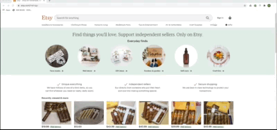

One of my friends, who is also an E-commerce guru, was looking a quick solution to Explore and Extract Data from the ETSY platform, and save it all under one roof. As a solution to the problem, I proposed using a Shiny Application connected to a Database.

We brainstormed and thought about the following Solution:

1. Let's build a simple application that uses ETSY API and stores extracted data from the product link in the database,

2. Moving forward we can build upon it and add features like "Track the daily updating views ", "See the changing prices over time", "How many people are following and liking the product" etc. and add KPI tracking Visualisations to make sense out of our data

3. Add an authentication layer so only his team members have the access to the tool.

Later I realized, This is not a simple tool but a potential Micro-SaaS platform. This is the power of data products! 🔥

